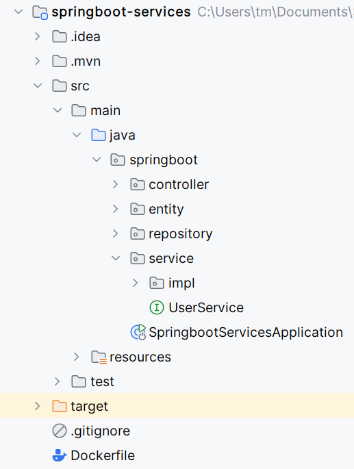

# Exercise 4: Run Web App and MYSQL database in a Docker network

If we have a Spring Boot appplication and a MySQL database, we will need to consider app and database as two different services. 
Basically, we are going to run the services in two separate docker containers. 
We will run the two containers in the same Docker network so that they can communicate with each other. 
In this exercise you will create a docker image for a Spring boot application, 
then create a docker container from the image and finally run the app in a docker container.

### Preconditions

This assumes you have installed Docker and Maven locally on your developer computer.

### Learning outcome

* Be able to create a docker network
* Make a web application and MySQL database communicate via a docker network
* Be able to run several containers in the same Docker network so they can communicate with each other. 
 

### MySQL Image in a Docker Container

1\)  
You should clone this repo as your starting point: [springboot-services-demo](https://github.com/Tine-m/spring-services-demo)
 
 The Spring Boot project architecture: 



2\)  
Let's first deploy the MySQL image in a docker container (or reuse an existing image).
Step1: Pull MySQL Image
Here is the docker command to pull the latest MySQL docker image:

```docker
docker pull mysql
```


#### Create a docker network

3\)  
Use this command to create a new network:

```docker
docker network create springboot-mysql-net
```

The network name is springboot-mysql-net.


4\)  
Use this command to list the networks:
```docker
docker network ls
```

#### Run MySQL image in a docker container in the network

5\)  
Run a MySQL image in a container in the network with this command:

```docker
docker run --name mysqldb --network springboot-mysql-net -e MYSQL_ROOT_PASSWORD=root -e MYSQL_DATABASE=employeedb -d mysql
```


#### Access the MySQL database in a container

6\) 
Here is the command to access the MySQL database in a container:

```docker
docker exec -it mysqldb bash
```

Verify that you have a database 'employeedb' (see how to do this in exercise 1 in case you have forgotten).
That's it. Next, we will run the Spring boot application in a docker container.

### Spring Boot Application in a docker Container in the network

I assume that you have downloaded the Spring boot project from the GitHub repository and set up the project in your IDE.

7\)  
Use the following command to maven build the project:

```maven
mvn clean package
```
Once maven builds with success, go to the target folder and see the generated fil:
springboot-services-0.0.1-SNAPSHOT.jar.

#### Create Dockerfile to Build the docker image
Docker builds images automatically by reading the instructions from a Dockerfile. The Dockerfile is a text file that contains all commands, in order, needed to build a given image. 

8\)  
Go to the project root directory and create a file named Dockerfile with the following content:


```docker
FROM eclipse-temurin:17

WORKDIR /app

COPY target/springboot-services-0.0.1-SNAPSHOT.jar /app/springboot-services.jar

ENTRYPOINT ["java", "-jar", "springboot-services.jar"]
```

FROM: A docker image can use another image available in the docker registry as its base or parent image. In the above example, we use the eclipse-temurin:17 image as our base image.

WORKDIR: This instruction creates a working directory in a docker container.

COPY: The COPY instruction copies new files or directories and adds them to the filesystem of the container at the path.

ENTRYPOINT: This is where you configure how the application is executed inside the container.

#### Adding Profile to Deploy in Docker Environment
Let's implement the profile in the Spring boot application to deploy it in a docker environment.

9\)  
Create an `application-docker.properties` file under the resources folder and insert the following:

```docker
spring.datasource.url=jdbc:mysql://mysqldb:3306/employeedb
spring.datasource.username=root
spring.datasource.password=root

spring.jpa.hibernate.ddl-auto=update
```

10\)  
Insert into the `application.properties` file:

```docker
spring.datasource.url=jdbc:mysql://localhost:3307/employeedb
spring.datasource.username=root
spring.datasource.password=root

spring.jpa.properties.hibernate.dialect=org.hibernate.dialect.MySQLDialect
spring.jpa.hibernate.ddl-auto=update

spring.profiles.active=docker
```

The localhost won't work in the docker network so we use the container name in the url: 'mysqldb'.

11\)  
Maven build the project again:

```maven
mvn clean package -DskipTests
```

Once maven builds with success, go to the target folder and see the file
`spring-boot-restful-web services-0.0.1-SNAPSHOT.jar`.


#### Build Docker Image from Dockerfile

Now that we have defined the Dockerfile, let’s build a docker image for our application.

Make sure that you’ve packaged the application in a jar file. 

12\)  
Build the docker image by typing the following command:

```docker
docker build -t springboot-services .
```

The file path . defines the location of the Dockerfile in the current directory, and the -t argument tags the resulting image, where the image name is the springboot-services and the tag is the latest.

13\)  
After the build is successfully finished, we can check to see if it appears in the list of docker images:

```docker
docker images
```

#### Run a docker image in a docker container in the same network

14\)  
Once you have a docker image, you can run a container like this:


```docker
docker run --network springboot-mysql-net --name springboot-mysql-container -p 8080:8080 springboot-services
```

Note that we are running the Spring boot application in a container in the same docker network (springboot-mysql-net).

### Demo

Test CRUD services using Postman Client or IntelliJs HTTP client.

Create User REST API:
Request URL: http://localhost:8080/api/users
HTTP Method: POST
Request Body:

```json
{
    "id": 1,
    "firstName": "Santa",
    "lastName":"Claus",
    "email": "xmas@gmail.com"
}
```

Get User REST API:
Request URL: http://localhost:8080/api/users/1

| [Prev <<](./DockerVolumeCompose.md) | [>> Next](./DockerWebAppMySQLCompose.md) | 
|:------:|:------:|
